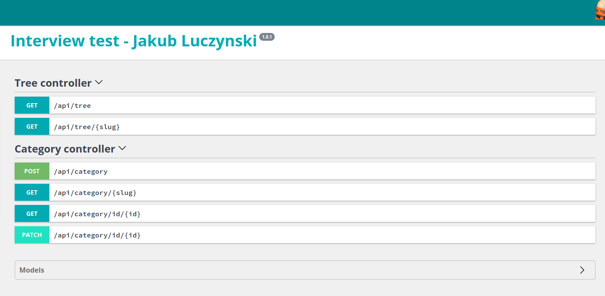
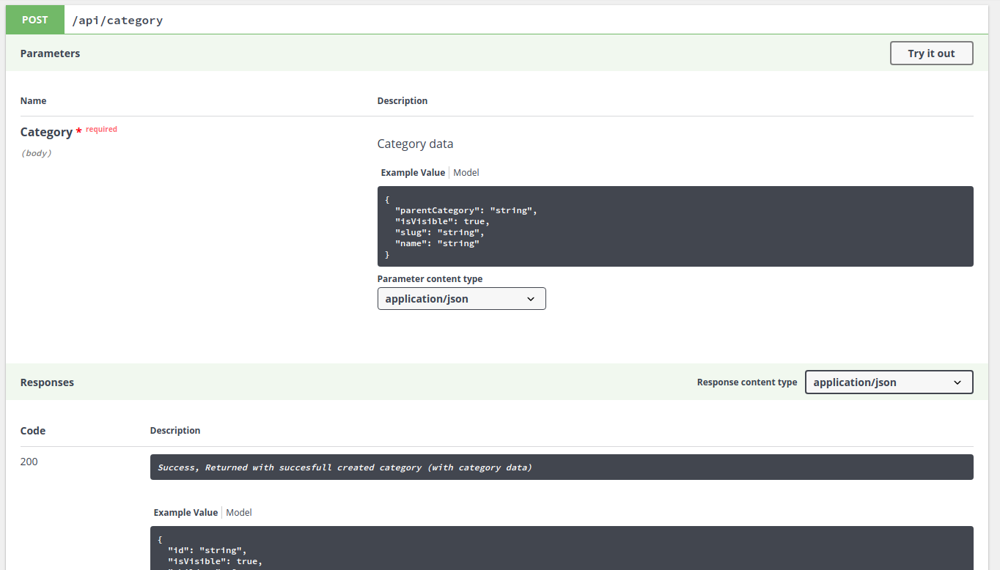
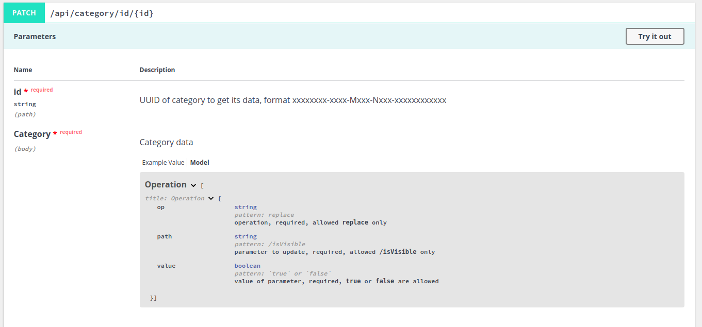
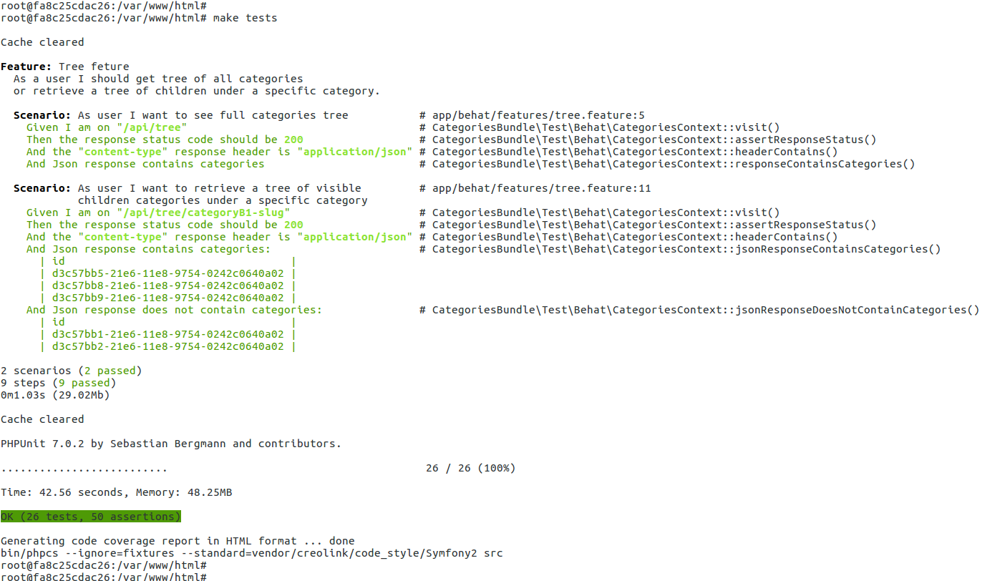

#Flaconi recrutation test#

===============================================================

#Objective#

Create a simple project to provide a RESTful API to manage categories for an e-commerce website.
More info on: https://github.com/Flaconi/coding-challenges/blob/master/senior-backend-engineer/restful-api-categories.md

--------------

#Install prerequisites#

Project is created for Linux. Tested on Ubuntu Gnome 16.04 (Xenial).

You have to install first:

* [Git](https://git-scm.com/downloads)
* [Docker](https://docs.docker.com/engine/installation/)
* [Docker Compose](https://docs.docker.com/compose/install/)

--------------

#Configuration#

Configure hosts
```sudo vim /etc/hosts```

add line
```192.100.10.20 flaconi.develop www.flaconi.develop```

Rest should be already configured by docker & composer.

All configuration variables are in `_docker/.env` file. Mysql access: `root` / `root`.

Used DB is MySQL. Initial SQL file is in `_docker/config/db`.

Used http server is Nginx, configuration is in `_docker/config/etc`.

Docker configuration is in `_docker/docker-compose.yml`, containers with theirs relevant configurations are in `_docker/containers`.

Application configuration is in: `.../application/app/config/parameters.yml.dist`
 In general `.../application/app/config/` folder contains all other configuration.


--------------

#Installation & Run#

In order to build images and run docker go to `flaconi/application/` and execute `make docker-up` (you should't need sudo here)

With error: `Couldn't connect to Docker daemon at http+docker://localunixsocket` do:

- `usermod -aG docker ${USER}` and relogin

Building images takes a while, but at the end you should be logged in into `flaconi_php` docker machine and site should be available in obrowser.
If the site does not work (`autoloader missed`) please wait a moment. Docker-composer is installing vendor components.

On docker-php machine you can use `make` to clear cache, create coverage, test, etc. Just execute `make` to see info.

Environment:

 * PHP 7.2.2
 * Xdebug 2.6.0
 * PHPUnit 7.0.2 with Mockery
 * Behat 3.2

--------------

#Usage#

* Site: `http://flaconi.develop/`
* PHPMyAdmin: `http://localhost:8080/`
* Swagger: `http://flaconi.develop/swagger`

Rest API Url:

* GET `http://flaconi.develop/api/tree`
* GET `http://flaconi.develop/api/tree/{slug}`
* POST `http://flaconi.develop/api/category`
* GET `http://flaconi.develop/api/category/{slug}`
* GET `http://flaconi.develop/api/category/id/{id}`
* PATCH `http://flaconi.develop/api/category/id/{id}`

You can test it with `Postman` or included `Swagger`.
More info about body parameters are available on `http://flaconi.develop/swagger`

PHPMyAdmin user / password: `root` / `root`. Database name: `flaconi`.

Use `make` to get info about possible commands. For example in order to clear cache on docker php machine use ```make clean``` (on docker machine).

Display test code coverage: http://flaconi.develop/coverage/index.html (after it was created with `make phpunit`)

All mentioned urls provide `production` environment.
In order to use testing environment - just add `/app_dev.php/` to URLs, for example:

* SWAGGER `http://flaconi.develop/app_dev.php/swagger`
* GET `http://flaconi.develop/app_dev.php/api/tree`


--------------

#Additional info#

Application is in `application` directory, docker config in `_docker` (`docker-compose` is used).
REST application for categories is in `application/src/CategoriesBundle`.
Validation for Json is based on JsonSchema (`.../CategoriesBundle/Resources/schema`)


All environment is tested on Ubuntu Gnome 16.04 (Xenial, 2 different machines):

 * Linux 4.4.0-116-generic #140-Ubuntu SMP Mon Feb 12 21:23:04 UTC 2018 x86_64 x86_64 x86_64 GNU/Linux
 * Linux 4.13.0-36-generic #40~16.04.1-Ubuntu SMP Fri Feb 16 23:25:58 UTC 2018 x86_64 x86_64 x86_64 GNU/Linux


Using production enviroment forces errors to save their contents ONLY in log files in `.../var/logs/` folder.
Testing enviroment should display errors directly to screen (with their full contents).

You can use `mc` in `php` & `server` machine if needed.

Codestyles are checked using Symfony standards: https://github.com/creolink/code_style


# Special thanks to Flaconi HR team for this opportunity. #

I'm sorry, I haven't covered all codes with tests (behat with fixtures especially), because I just didn't have enough time.
I used `Swagger` `@SWG` annotations instead of `@ApiDoc` because, `@ApiDoc` is deprecated by Nelmio 3
 ( please read https://github.com/nelmio/NelmioApiDocBundle/blob/master/UPGRADE-3.0.md )


# Warning! #

 * Do not delete `var` folder!
 * Using `phpunit` with functional testing changes rights of `var/*` folders. It is the best to use `make clean` after testing.
   (I haven't fixed this yet)
 * Behat and Functional tests are prepared to work with `http://flaconi.develop/` address and `flaconi` database.
   This means, tests passes only for default database.
   This also means, that tests of update / create works on existing values (create new categories)
   I just didn't have time to configure everything properly.

--------------

# Tests / Code style checks#

WARNING!!! EXECUTE IT ONLY ON `DOCKER-PHP` MACHINE

All tests:
```
make tests
```

PHPUnit:
```
make phpunit
```

Behat:
```
make behat
```

PHPCS:
```
make phpcs
```

--------------

Screens:











